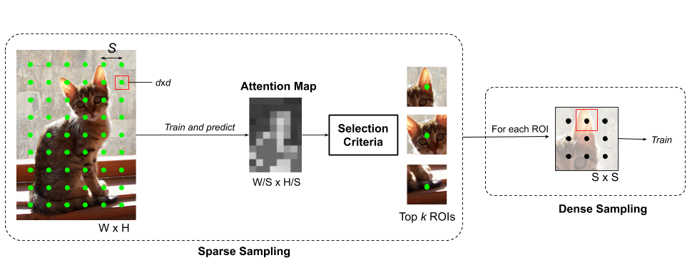

# bda-attention

--------------------------------------------------------------------------- 
### Overview: 

The Breadth-Depth Attention (BDA) framework is a weakly supervised learning technique designed to 
explore and extract relevant information for a particular task from large images. BDA employs
a unique sampling schema to iteratively capture global information and then densely sample in
specific regions of interest in an image.
This method was designed to analyse whole slide images of breast tissue and the code reflects
an experimental design for identifying cancer recurrence from large microscopic images. 

--------------------------------------------------------------------------- 

Prerequisites:
* Python (tested on version 3.5)
* openslide 
* Tensorflow
* Keras

### Background

To explore a large image space we adopt the concept of *attention* which has been widely applied 
in machine translation, natural language processing and explainability research. Historically, 
attention-based mechanisms are a method of weighting a context vector such that global information 
is captured from a large series of information, for example a document or paragraph of text. Here, 
we use attention to analyse large, detailed images in a weakly-supervised learning framework, 
whereby the only manual input is provided at the image-level. In order to discover relevant regions 
of interest, we sparsely sample a large image space for global information and pay particular 
attention to specific ROIs by densely sampling. We call our framework Breadth-Depth Attention (BDA).

### Details

BDA is a framework which wraps around a core network architecture, whether that
may be a convolutional neural network, fully connected network etc. This core model progressively 
undergoes changes at all phase of BDA and receives patches of a fixed size. 
What makes BDA different to a classical deep learning framework is that each epoch is redesigned 
to include two types of sampling techniques. First, a regular grid (with some randomization) is used to sparsely 
sample ROIs across the entirity of each image. Then attention is placed on specific points in the 
sparse grid by analysing areas in which the network is performing poorly via a probabilistic 
attention map. By applied both sampling criteria in this manner we ensure that the network sufficiently 
represents a large space, thus avoiding overfitting, whilst at the same time capturing detailed 
information relative to a specific task.

This repository contains code to implement BDA for a 2-class problem on whole slide images. It also originally
was designed to incorporate a ductal mask however this had been removed for anonymization purposes. 
Patches in this implementation are of size 256 x 256. The extract directory is very similar to the deep-openslide repo.

Note: this is ongoing work

